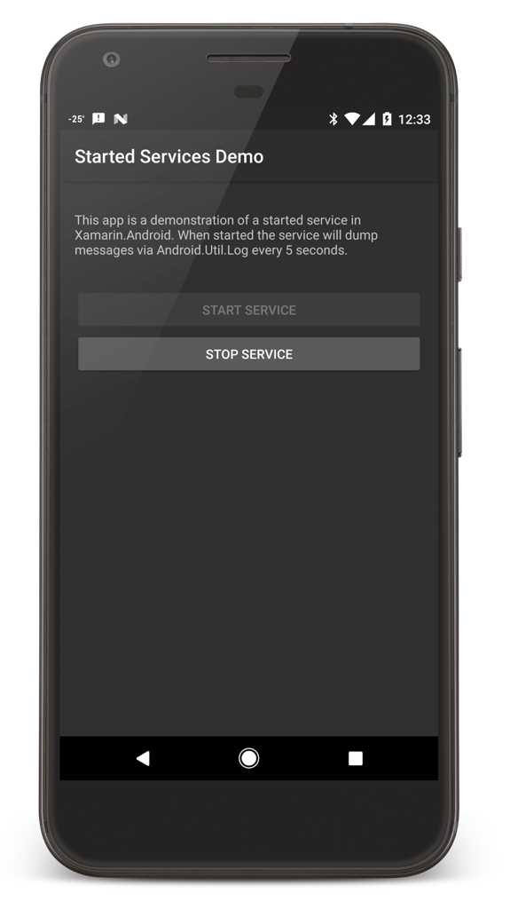

# Xamarin.Android Started Service Sample

This directory holds the sample project for the [creating a started service section](https://docs.microsoft.com/xamarin/android/app-fundamentals/services/creating-a-service/started-services) of the [Creating Services](https://docs.microsoft.com/xamarin/android/app-fundamentals/services/) guide for Xamarin.Android.

