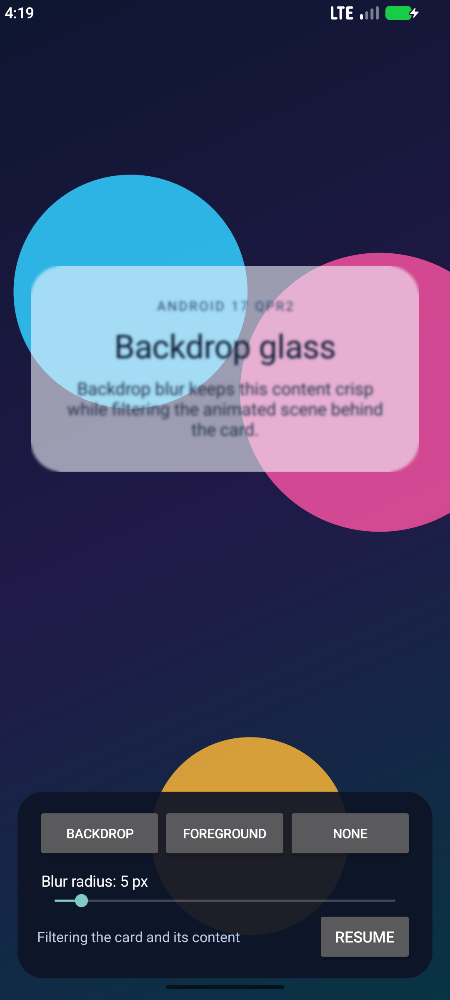
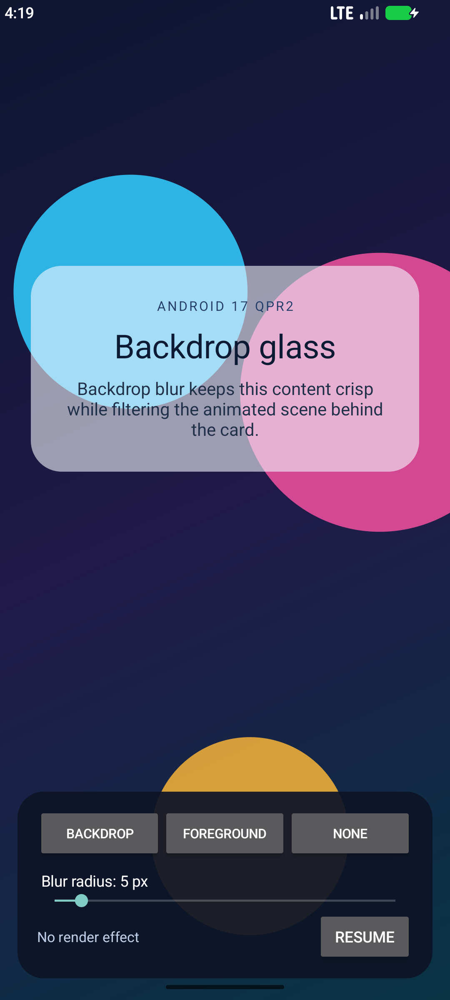

# Backdrop Effects

This sample demonstrates backdrop render effects introduced in Android 17 QPR2
(API 37.2). An animated scene moves behind a translucent card so the difference
between filtering the backdrop and filtering the view itself is immediately
visible.

## What the sample does

- Applies a blur to pixels behind the translucent card
- Compares backdrop blur with the existing foreground render effect
- Adjusts the blur radius while the scene is animating
- Pauses the animation for close visual comparison

## Screenshots

| Backdrop effect | Foreground effect | No effect |
|---|---|---|
|  |  |  |

These states were captured on an Android 17 QPR2 Beta 4 emulator at a 5 px
blur radius.

## Requirements

| Requirement | Value |
|---|---|
| Target framework | `net11.0-android37.2` |
| Device or emulator | Android 17 QPR2 / API 37.2 |
| Rendering | Hardware acceleration |
