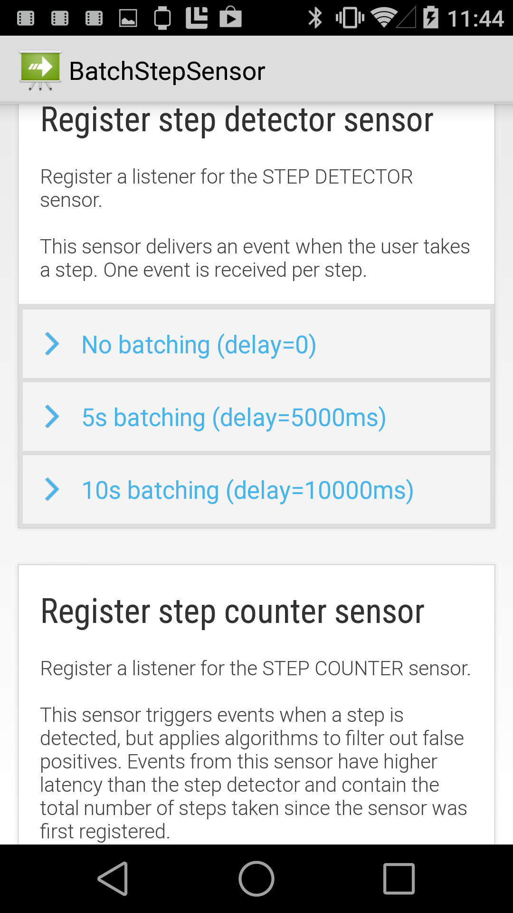

# Batch Step Sensor for Xamarin.Android

This sample demonstrates how to set up and use Android 4.4's step counting APIs with batching (letting the system collect multiple step events before returning them to the application.)

## How to Build and Run this Sample

To build, install Visual Studio with Mobile Development for .NET (Xamarin) workload, open the project and build. In order to fully use this sample, you should deploy to a device that had step counting sensors.

This sample requires Android 4.4 (KitKat).

