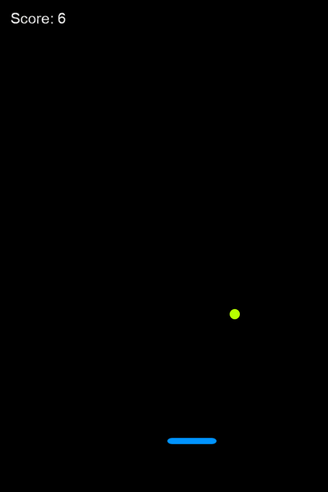

# CocosSharp BouncingGame Project for Android

This is a small, complete game using CocosSharp for Android.  It is the result of working through the the entire Introduction to CocosSharp walkthrough.

This single solution contains two projects:  one for Android and one cross-platform portable class library.

The game can be played by touching the screen to move the paddle at the bottom of the screen horizontally.  The goal is to keep the ball from falling off-screen.  Each bounce awards the player one point.

## Author

Victor Chelaru