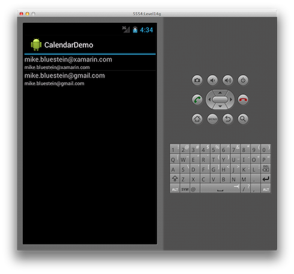

# Calendar Demo

This example shows how to use the calendar API to list calendars and events.
It also shows how to add an event and view it using the built-in calendar app.

Also see the [documentation](https://docs.microsoft.com/xamarin/android/user-interface/controls/calendar).
