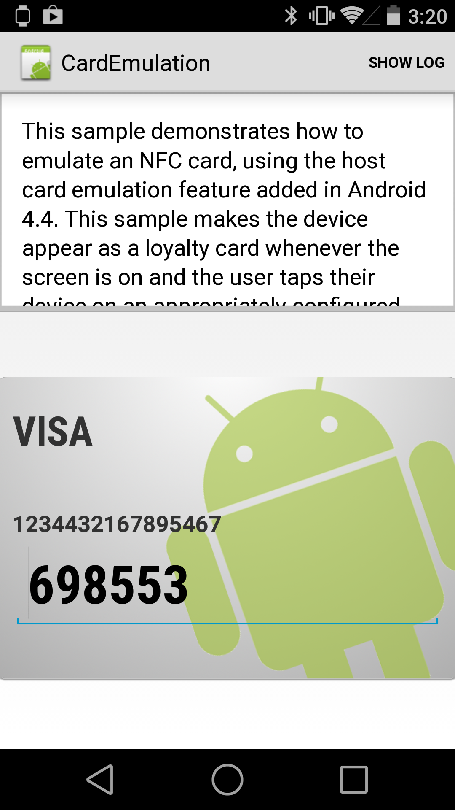

# CardEmulation Sample

This sample demonstrates the use of the new Host Card Emulation (HCE) APIs in Android 4.4 (KitKat).

This sample also demonstrates how to declare an Android service using C# attributes (CardService.cs) which will be automatically added to the AnroidManifest.xml.

## Instructions

* In order to run this sample, you will need two NFC-capable physical devices. One with this project (CardEmulation) installed, and another with the CardReader sample installed. Run each on the device it was installed on, then place the backs of the two devices together in order to allow NFC communication to occur.

## Build Requirements

Download the latest version of Xamarin Studio. Open CardEmulation.sln in Xamarin Studio and either build or run the project.

## License

Copyright (c) 2005-2008, The Android Open Source Project  
