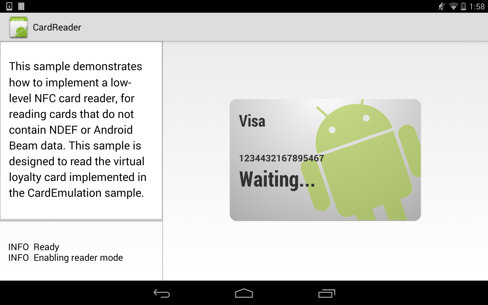

# CardReader

This sample demonstrates how to implement a low-level NFC card reader, for reading cards that do not contain NDEF or Android Beam data. This sample is designed to read the virtual loyalty card implemented in the "CardEmulation" sample.

## Instructions

- In order to run this sample, you will need two NFC-capable physical devices. One with this project (CardEmulation) installed, and another with the CardReader sample installed. Run each on the device it was installed on, then place the backs of the two devices together in order to allow NFC communication to occur.

## Build Requirements

Download the latest version of Visual Studio. Open CardReader.sln and either build or run the project. This project requires the API level 19 SDK.

## License

Copyright (c) 2005-2008, The Android Open Source Project  
