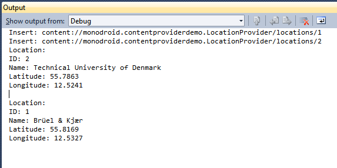

# Content Provider Demo

Just a small example showing how a Content Provider can be implemented in Mono for Android.

I used this [article](http://www.devx.com/wireless/Article/41133/1954) as reference.

## Author

Tomasz Cielecki aka [Cheesebaron](https://github.com/Cheesebaron)
