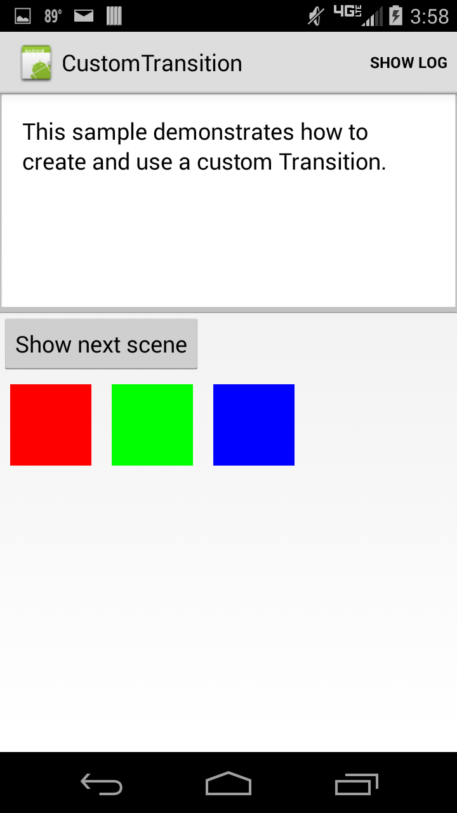

# Custom Transitions

This sample demonstrates how to create custom transitions to go from one scene in their app to the next. The transition created in this sample smoothly changes between three scenes which each have three colored boxes with the colors in a different order in each scene.

## Instructions

- Press the "Show next scene" button to cycle the colors using a custom transition.
- Press the "Show Log" button to show what is logged as the transitions occur

## Build Requirements

This sample requires the SDK platform level 19 to build and a device that is level 19 or newer to run.

## License

Copyright (c) 2005-2008, The Android Open Source Project  
