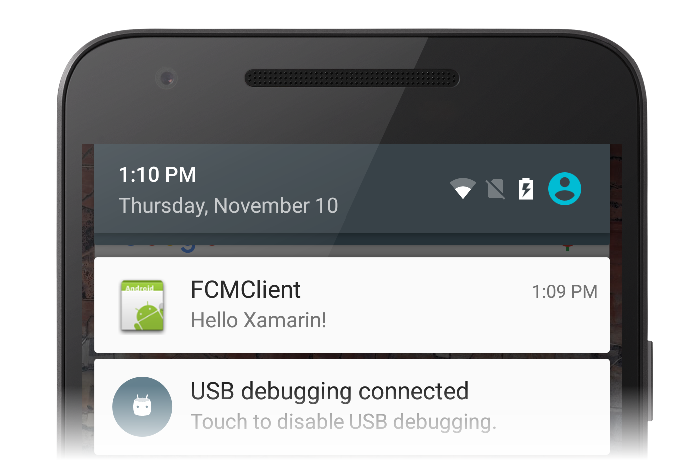

# Android FCM Remote Notifications

This sample app accompanies the article
[Remote Notifications with Firebase Cloud Messaging](https://docs.microsoft.com/xamarin/android/data-cloud/google-messaging/remote-notifications-with-fcm).
Before you can use this sample, you must acquire the necessary
credentials to use Google's servers; this process is explained in
[Firebase Cloud Messaging](https://docs.microsoft.com/xamarin/android/data-cloud/google-messaging/firebase-cloud-messaging).

In particular, you must download **google-services.json** from the
[Firebase Console](https://console.firebase.google.com/) (this file
contains your credentials) and add it to the app project, replacing the
dummy **google-services.json** that comes with this sample.

Most of the action takes place "behind the scenes", and is to be
observed by watching the output window while the app runs from
the IDE.

