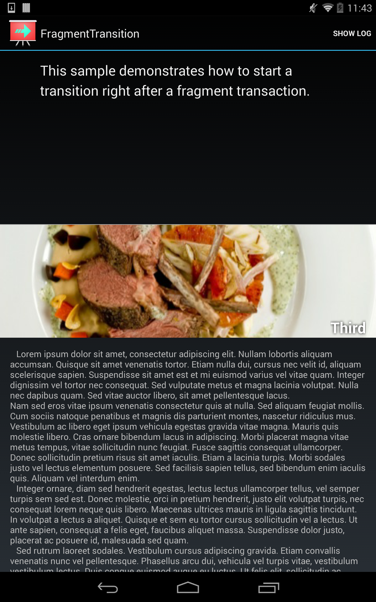

# Fragment Transition

This sample demonstrates how to start a transition right after a fragment transaction. This allows for more fluid transitions and animations between different fragments such has holding a image in place as the fragment exits and then expand to it's new location/size.
Note: This sample is not fluid on Android L Developer Preview. This problem exists for both the Monodroid port and the original Java sample from Google.

