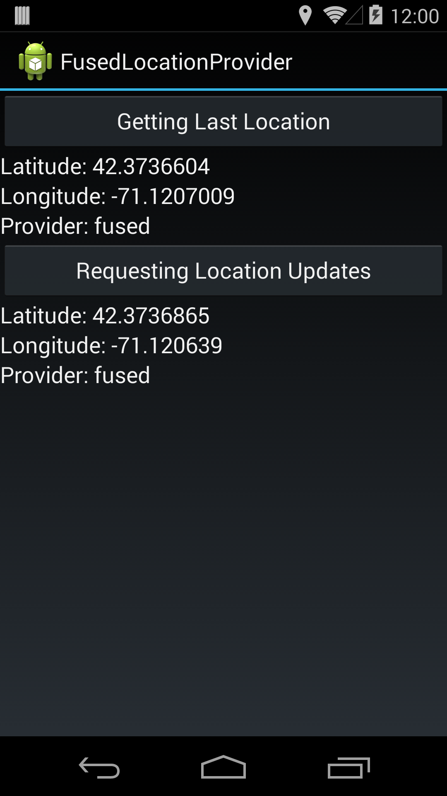

# FusedLocationProvider Sample

This sample provides an example of gathering location data using the
FusedLocationProvider, available as part of Google Play services. A detailed
walkthrough of the sample code can be found in the
[Xamarin Location Services](https://docs.microsoft.com/xamarin/android/platform/maps-and-location/location) guide.

