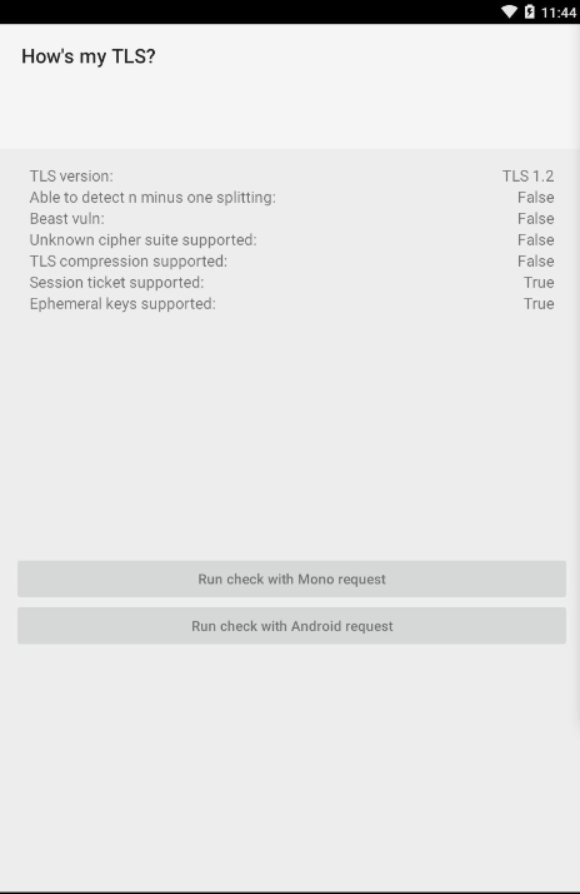

# How's my TLS?

This sample demonstrates how to make a basic TLS connection using different classes available for Xamarin.Android developers:

- `HttpWebRequest` + `WebResponce`  - doesn't have support of TLSv1.2, maximum  version of supported TLS is 1.0
- `AndroidClientHandler` + `HttpClient` + `AndroidHttpResponseMessage`  - allows to establish secure TLSv1.2 connections

