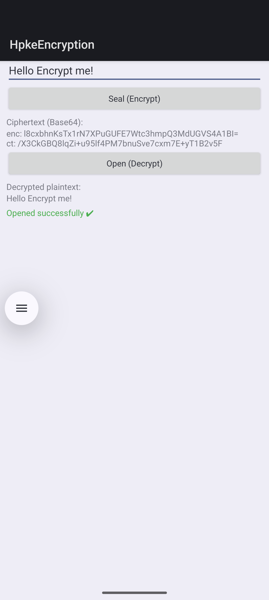

# HPKE Encryption

This sample demonstrates the **Hybrid Public Key Encryption (HPKE)** APIs from the
`android.crypto.hpke` package, introduced in **Android 17 (API 37)**.

HPKE (RFC 9180) combines asymmetric and symmetric cryptography to let a sender encrypt
a message to a recipient's public key in a single "seal" operation, and the recipient
decrypt it with their private key in a single "open" operation.

## What the sample does

- Generates an **X25519** key pair at startup
- Configures an HPKE instance with **DHKEM(X25519, HKDF-SHA256) + HKDF-SHA256 + AES-128-GCM**
- Lets the user type a message and **Seal (encrypt)** it, displaying the Base64-encoded ciphertext
- Lets the user **Open (decrypt)** the ciphertext back to plaintext

## Screenshot

## Requirements

| Requirement | Value |
|---|---|
| Minimum SDK | Android 17 (API 37) |
| .NET | net11.0-android37 |
