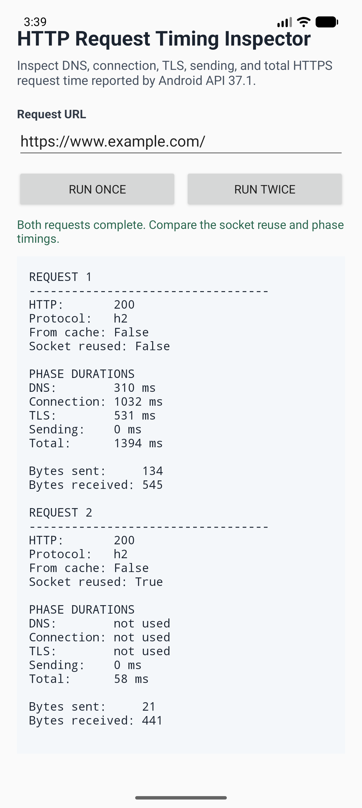

# HTTP Request Timing Inspector

This sample uses the Android HTTP stack to issue a request and display the
fine-grained metrics exposed by `android.net.http.FinishedRequestTimings` in
Android API 37.1.

## What the sample does

- Sends a GET request to an HTTPS URL with `HttpEngine` and `UrlRequest`
- Displays DNS, connection, TLS handshake, request sending, and total durations
- Displays the negotiated protocol and the number of bytes sent and received
- Reports whether the request reused an existing socket
- Runs two requests sequentially through one `HttpEngine` so connection reuse
  can be compared with the first request

The response body is read and discarded. Reading to the end is required for the
request to reach its successful terminal callback and produce complete timing
information.

## APIs demonstrated

- `Android.Net.Http.FinishedRequestTimings`
- `Android.Net.Http.UrlRequest.FinishedRequestTimings` property
- `FinishedRequestTimings.RequestStart` and `RequestEnd`
- `FinishedRequestTimings.DnsStart` and `DnsEnd`
- `FinishedRequestTimings.ConnectingStart` and `ConnectingEnd`
- `FinishedRequestTimings.TlsHandshakeStart` and `TlsHandshakeEnd`
- `FinishedRequestTimings.SendingStart` and `SendingEnd`
- `FinishedRequestTimings.SentByteCount` and `ReceivedByteCount`
- `FinishedRequestTimings.WasSocketReused()`

Unavailable phases are shown as `not used`. This is expected when a connection
is reused and no new DNS lookup, connection, or TLS handshake is needed.

## Screenshot

## Requirements

| Requirement | Value |
|---|---|
| Device or emulator | Android API 37.1 or later |
| .NET SDK | .NET 11 RC2 or later (currently unreleased) |
| Target framework | `net11.0-android37.1` |
| Network access | Required |

Enter an absolute HTTPS URL, then select **Run once** or **Run twice**.
The default URL is `https://www.example.com/`.
