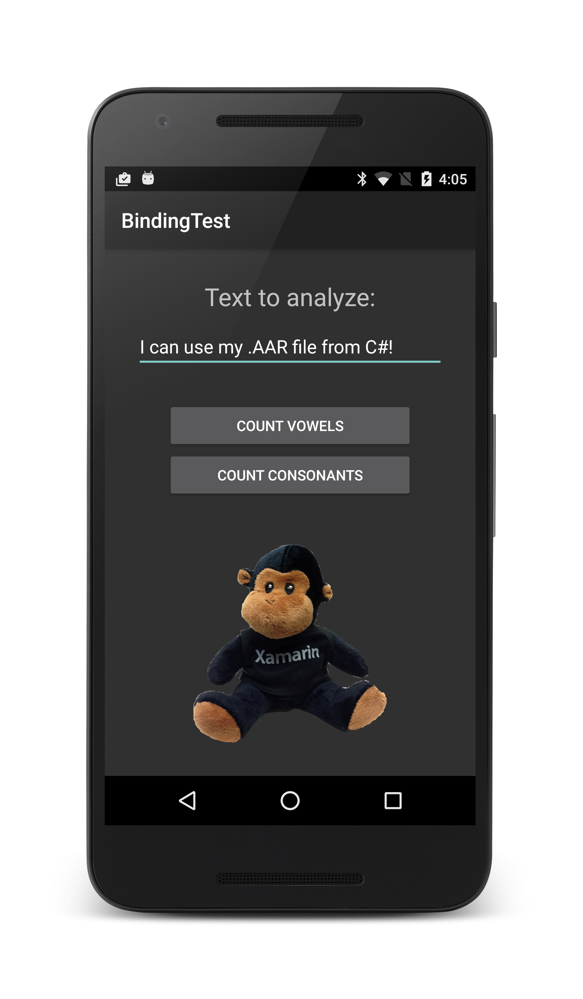

# Binding an .AAR Example 

This sample app accompanies the article, 
[Binding an .AAR](http://developer.xamarin.com/guides/android/advanced_topics/java_integration_overview/binding-a-java-library/binding-an-aar/).

This sample can help you understand how a Xamarin.Android application 
can reuse existing Java code that is packaged in an Android .AAR. This 
sample also demonstrates how to access and use .AAR resources. 

The `MainActivity` of the app prompts the user for a string and uses a 
`TextCounter` class within the .AAR to count the number of vowels and 
consonants in the string. (The Android Studio project and Java source 
for the .AAR is included.) In addition, an image resource is retrieved 
from the .AAR to assist in displaying the count results. 

Most of the "heavy lifting" is done by the .AAR. The example app simply 
accepts input from the user, sends it to the .AAR for text analysis, 
then displays results. 

Two projects are contained in this solution. The `AarBinding` project 
is the Binding Project that wraps the `textanalyzer.aar` file, and the 
`BindingTest` project is the test app that references `AarBinding`. 

## Author 

Mark McLemore

