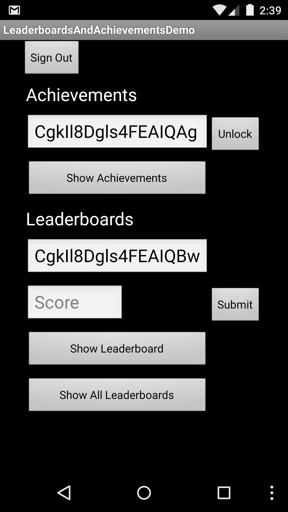
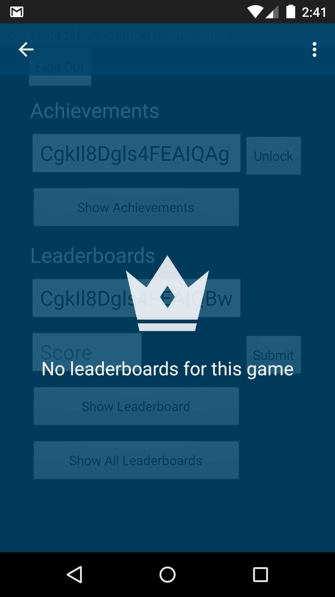
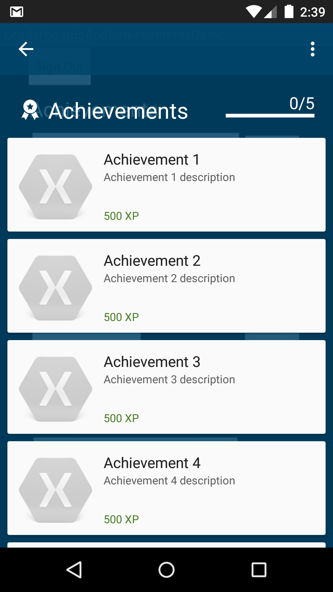

LeaderboardsAndAchievementsDemo
===============================

This is a sample xamarin android application that shows the [Leaderboards](https://developers.google.com/games/services/android/leaderboards) and [Achievements](https://developers.google.com/games/services/android/achievements) for a specific provided game of Google Play Games.

##Setup

You must have a created game in your [Google Play Developer Console](https://play.google.com/apps/publish). If you **don't have a game**, you need to create one following these steps:

1. Sign in to the Google Play Developer Console
2. Add your game to the Google Play Developer Console
3. Generate an OAuth 2.0 client ID
  * Create a linked application
4. Paste you Game ID in [Strings.xml](https://github.com/xamarin/monodroid-samples/blob/master/LeaderboardsAndAchievementsDemo/Resources/values/Strings.xml) file. You have to replace the *PASTE_YOUR_GAME_ID_HERE* text.
  
For more information, please visit this [web site](https://developers.google.com/games/services/console/enabling).

##Screenshots

Author
-------

Gonzalo Martin
