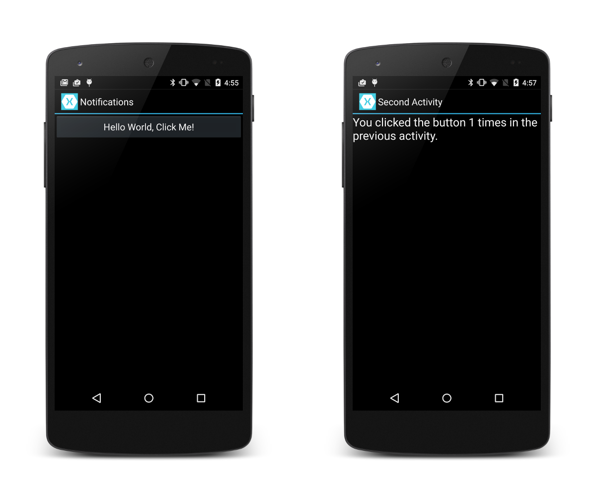

# Android Local Notifications Sample

This sample app accompanies the article, 
[Walkthrough - Using Local Notifications in Xamarin.Android](http://developer.xamarin.com/guides/cross-platform/application_fundamentals/notifications/android/local_notifications_in_android_walkthrough/).

When you tap the button displayed in the MainActivity screen, a 
notification is created. When you tap the notification, it 
takes you to a SecondActivity screen. 

