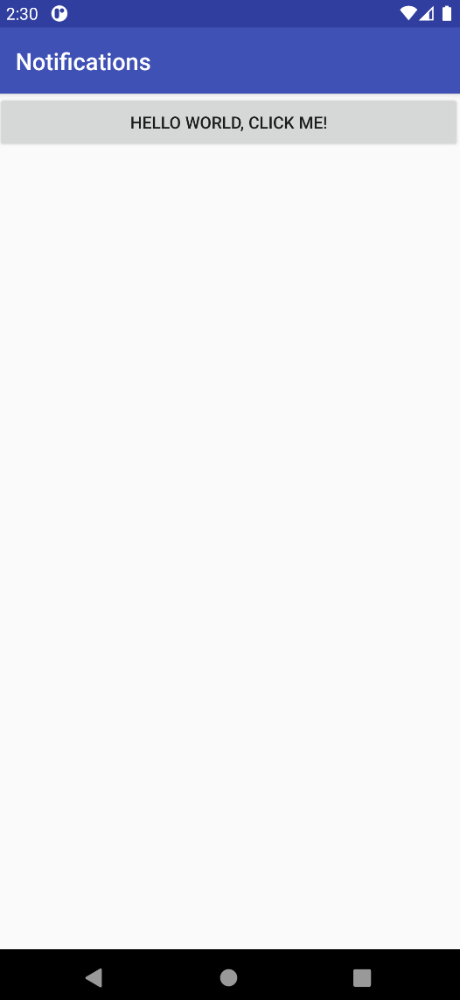

# Android Local Notifications Sample

This sample app accompanies the article,
[Walkthrough - Using Local Notifications in .NET for Android](https://docs.microsoft.com/xamarin/android/app-fundamentals/notifications/local-notifications-walkthrough).

When you tap the button displayed in the MainActivity screen, a
notification is created. When you tap the notification, it
takes you to a SecondActivity screen.
