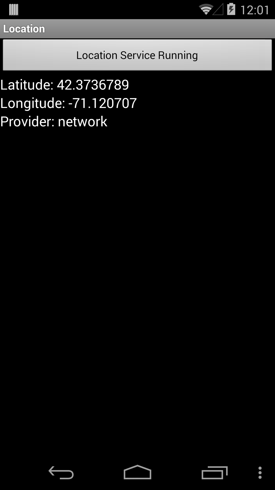

# Android Location Services Sample

This sample provides an example of gathering location data using the Android location system service, as explained in the [Xamarin Location Services](https://docs.microsoft.com/xamarin/android/platform/maps-and-location/location) guide.

