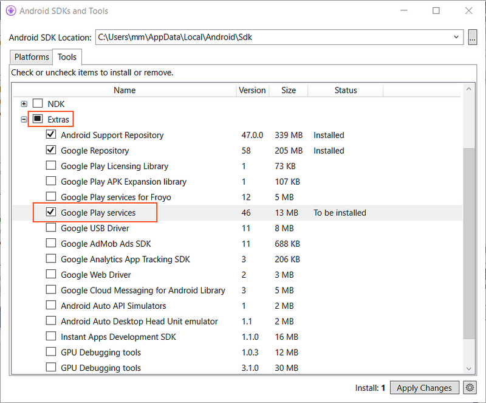

Google Maps v2 Demo
===================

This code provides an example of how to use Google Maps v2 in an
Android application. The **SimpleMapDemo** project demonstrates the
basic features of Google Maps for Android v2. It requires the Google
Play Services client library, and it is designed to run on API 15
devices and later.

For an example of gathering location data,
see the [FusedLocationProvider](https://developer.xamarin.com/samples/monodroid/FusedLocationProvider/)
code example. (The **LocationDemo** project that was previously part of
**MapsAndLocationDemo\_v3** is obsolete and has been removed from the
solution.)

## Prerequisites

- The **SimpleMapDemo** sample uses Xamarin GooglePlayServices NuGets
  that are automatically downloaded when you build the project.

- You must also have the Google Play Client Services library installed
  in order to use the Component. You can install this by using the
  Android SDK Manager. This library is available under **Tools > Extras**:

    

**Note:** The package name of your application should be all lower
case. Android is very particular and the Google Maps API will not
authenticate the API key property if the package name has mixed case.

Google Maps v2 API Key
----------------------

You must
[obtain a new API Key](https://developers.google.com/maps/documentation/android/start#the_google_maps_api_key)
for Google Maps v2. API keys from Google Maps v1 will not work.

The location of the debug.keystore file that Xamarin.Android uses
depends on your platform:

- **Windows**: `C:\Users\[USERNAME]\AppData\Local\Xamarin\Mono for Android\debug.keystore`
- **macOS** : `/Users/[USERNAME]/.local/share/Xamarin/Mono for Android/debug.keystore`

To obtain the SHA1 fingerprint of the debug keystore, you can use the
`keytool` command that is a part of the JDK. This is an example of
using `keytool` at the command-line:

    $ keytool -V -list -keystore debug.keystore -alias androiddebugkey -storepass android -keypass android

Adding the API Key to your application
--------------------------------------

The API key goes in your application's manifest, contained in the file
**Properties/AndroidManifest.xml**. From there, the Maps API reads the key
value and passes it to the Google Maps server, which then confirms that
you have access to Google Maps data.

In AndroidManifest.xml, add the following element as a child of the
`<application>` element, by inserting it just before the closing tag
`</application>`

    <application android:label="@string/app_name">

		<!-- Put your Google Maps V2 API Key here. This key will not work for you.-->

		<!-- See https://developers.google.com/maps/documentation/android/start#obtaining_an_api_key -->

		<meta-data android:name="com.google.android.maps.v2.API_KEY" android:value="SAzaSyC1O8yQaNtuur4t5y6u7ZBPnYdVDgYKHtfA8" />

	</application>

Specifying additional permissions
---------------------------------

Besides permissions required by other parts of your application, you
must add the following permissions to AndroidManifest.xml in order to
use the Google Maps Android API:

	<!-- We need to be able to download map tiles and access Google Play Services-->

	<uses-permission android:name="android.permission.INTERNET" />

	<!-- Allow the application to access Google web-based services. -->

	<uses-permission android:name="com.google.android.providers.gsf.permission.READ_GSERVICES" />

	<!-- Google Maps for Android v2 will cache map tiles on external storage -->

	<uses-permission android:name="android.permission.WRITE_EXTERNAL_STORAGE" />

	<!-- Google Maps for Android v2 needs this permission so that it may check the connection state as it must download data -->

	<uses-permission android:name="android.permission.ACCESS_NETWORK_STATE" />

	<!-- These are optional, but recommended. They will allow Maps to use the My Location provider. -->

	<uses-permission android:name="android.permission.ACCESS_COARSE_LOCATION" />

	<uses-permission android:name="android.permission.ACCESS_FINE_LOCATION" />
  
Verifying Google Play Services installation on your device or emulator
----------------------------------------------------------------------

[Google Play Services](https://play.google.com/store/apps/details?id=com.google.android.gms)
must be installed on a device or emulator before Google Maps for
Android v2 will work.

Emulators using the
[Google APIs Add-On](https://developers.google.com/android/add-ons/google-apis/)
with API 17 and higher have Google Play Services included in the Google
APIs Add On.

Emulators not using the Google APIs Add-On images, *will not have
Google Play Services installed*. The appropriate APKs may be manually
installed into the emulator image, but installing Google Play Services
is beyond the scope of this example.

If the device does not have Google Play Services installed, you will
see a stack trace similar to the following:

	com.htc.autotest.dlib.RecordEngine in loader dalvik.system.DexClassLoader@4052ca48Loaded assembly: Mono.Android.Support.v4.dll [External]
	
	Google Play services is missing.
	Google Play services is missing.
	Google Play services is missing.
	Shutting down VM
	FATAL EXCEPTION: main
	java.lang.NoClassDefFoundError: com.google.android.gms.R$string
		at com.google.android.gms.common.GooglePlayServicesUtil.b(Unknown Source)
		at com.google.android.gms.internal.d.a(Unknown Source)
		at com.google.android.gms.internal.d.onCreateView(Unknown Source)
		at com.google.android.gms.maps.SupportMapFragment.onCreateView(Unknown Source)
		at android.support.v4.app.Fragment.performCreateView(Fragment.java:1460)
		at android.support.v4.app.FragmentManagerImpl.moveToState(FragmentManager.java:911)
		at android.support.v4.app.FragmentManagerImpl.moveToState(FragmentManager.java:1088)
		at android.support.v4.app.BackStackRecord.run(BackStackRecord.java:682)
		at android.support.v4.app.FragmentManagerImpl.execPendingActions(FragmentManager.java:1444)
		at android.support.v4.app.FragmentActivity.onStart(FragmentActivity.java:551)
		at android.app.Instrumentation.callActivityOnStart(Instrumentation.java:1201)
		at android.app.Activity.performStart(Activity.java:3908)
		at android.app.ActivityThread.performLaunchActivity(ActivityThread.java:1794)
		at android.app.ActivityThread.handleLaunchActivity(ActivityThread.java:1842)
		at android.app.ActivityThread.access$1500(ActivityThread.java:132)
		at android.app.ActivityThread$H.handleMessage(ActivityThread.java:1038)
		at android.os.Handler.dispatchMessage(Handler.java:99)
		at android.os.Looper.loop(Looper.java:143)
		at android.app.ActivityThread.main(ActivityThread.java:4263)
		at java.lang.reflect.Method.invokeNative(Native Method)
		at java.lang.reflect.Method.invoke(Method.java:507)
		at com.android.internal.os.ZygoteInit$MethodAndArgsCaller.run(ZygoteInit.java:839)
		at com.android.internal.os.ZygoteInit.main(ZygoteInit.java:597)
		at dalvik.system.NativeStart.main(Native Method)
	Sending signal. PID: 19208 SIG: 9
	
	
# Troubleshooting

## AAPT.EXE location incorrect

Google changed the location of certain tools in r22 of the Android SDK
(release in mid-May, 2013), which may cause Xamarin.Android to report
this error. The forum post
[aapt.exe location incorrect](http://forums.xamarin.com/discussion/comment/15360/#Comment_15360)
contains some helpful advice for dealing with this issue.

## "does not implement inherited abstract member" compile error

This error is typically caused by a stale `google-play-services_lib`
directory &ndash; Ensure that you have an up-to-date version of the
Google Play Services library via the Android SDK manager, and ensure
that the Android Library project that your project is using is also up
to date. The forum post
[Google Maps v2 and "does not implement inherited abstract member" messages](http://forums.xamarin.com/discussion/5030/google-maps-v2-and-does-not-implement-inherited-abstract-member-messages)
will also be useful in troubleshooting this issue.
