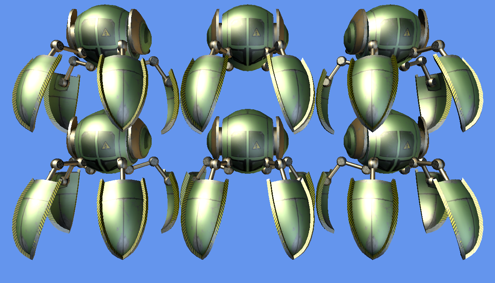

# MonoGame Model Drawing Project for Android

This project shows how to load a XNB file into a MonoGame Model instance. Once loaded the Model instance is drawn on-screen six times. It is the result of working through the [MonoGame Model walkthrough](https://docs.microsoft.com/xamarin/graphics-games/monogame/3d/part1).

This single solution contains two projects:  one for Android and one cross-platform portable class library.

