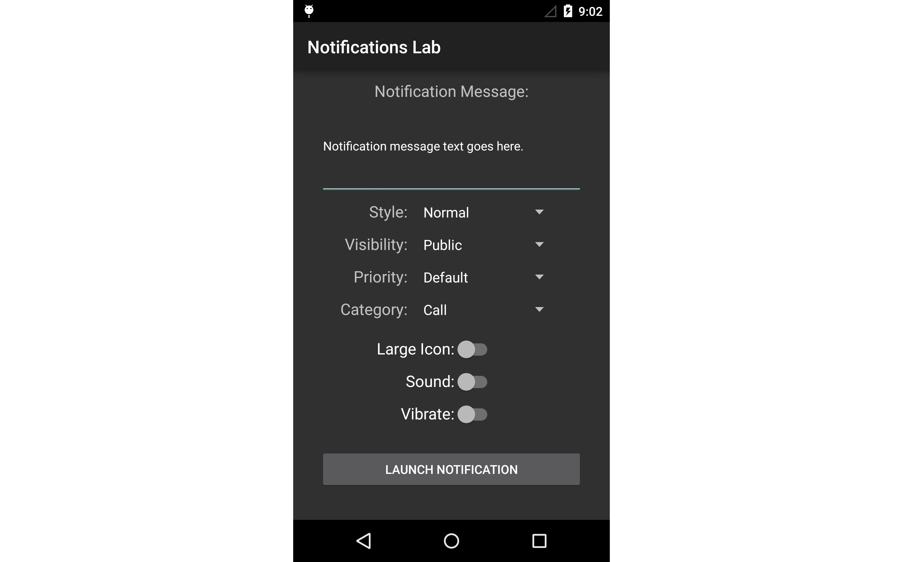

Android 5.0 Lollipop Notifications Lab
======================================

This sample app accompanies the article, 
[Notifications in Android 5.0 Lollipop](http://developer.xamarin.com/guides/android/platform_features/android_l/notifications_in_android_l).
You can use this sample to try out the different notification styles and options
that were introduced in the Android L Developer Preview.

A single screen provides the following options for selecting
the "ingredients" of a notification: 

-  A textbox to enter the notification text.

-  A selector for the notification style (normal, big text, image, inbox).

-  A selector for the visibility level of the notification on the 
   lockscreen (public, private, secret).
 
-  A selector for the priority of the notification (low, mimimum, default, 
   high, maximum). 
 
-  A selector for the category of the notification.

-  Switches for enabling/disabling large icon, sound, and vibrate
   options.

A launch button is located at the bottom of the screen to post a 
notification with the above-selected options.                                        

To build and run this sample, you must first enable Android L support as 
described in 
[Setting Up an Android L Project](http://developer.xamarin.com/guides/android/platform_features/android_l/introduction_to_android_l#settingup).
You will need an Android device or emulator with a large screen (such as 
a Nexus 5 or an AVD with the WXGA720 skin) to view and select from all 
of the options.

Author
------ 

Mark McLemore
