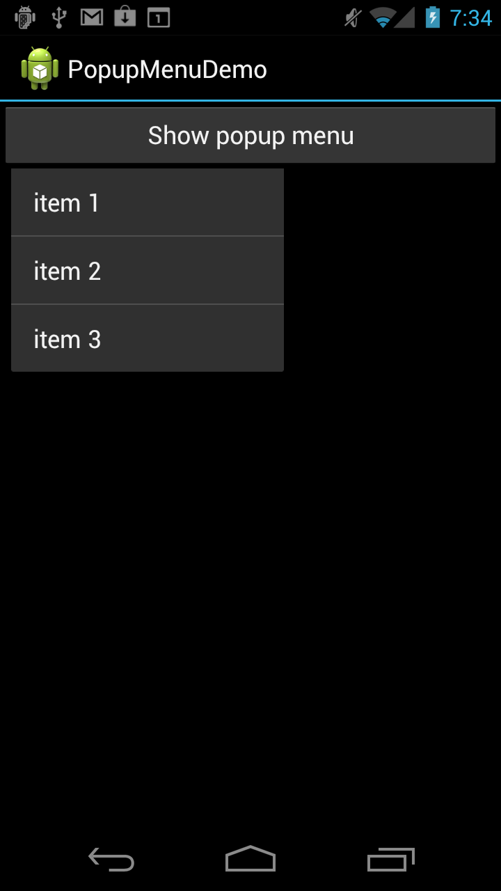

# Popup Menu Demo

**PopupMenuDemo** is a sample app that accompanies the article,
[PopUp Menu](https://docs.microsoft.com/xamarin/android/user-interface/controls/popup-menu).
It demonstrates how to add support for displaying popup menus that are attached to
a particular view.

