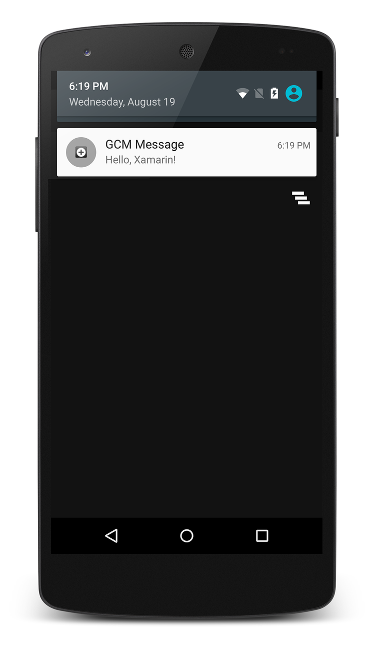

# Android GCM Remote Notifications

This sample app accompanies the article 
[Remote Notifications with Google Cloud Messaging](http://developer.xamarin.com/guides/android/application_fundamentals/notifications/remote-notifications-with-gcm/).
Before you can use this sample, you must acquire the necessary 
credentials to use Google's servers; this process is explained in 
[Google Cloud Messaging](http://developer.xamarin.com/guides/android/application_fundamentals/notifications/google-cloud-messaging). 
In particular, you will need an *API Key* and a *Sender ID* to insert 
into the example code before it can connect to GCM. 
   
Most of the action takes place "behind the scenes", and is to be
observed by watching the output window while the app runs from
the IDE.

## Author 

Copyright 2016 Xamarin

Mark McLemore
