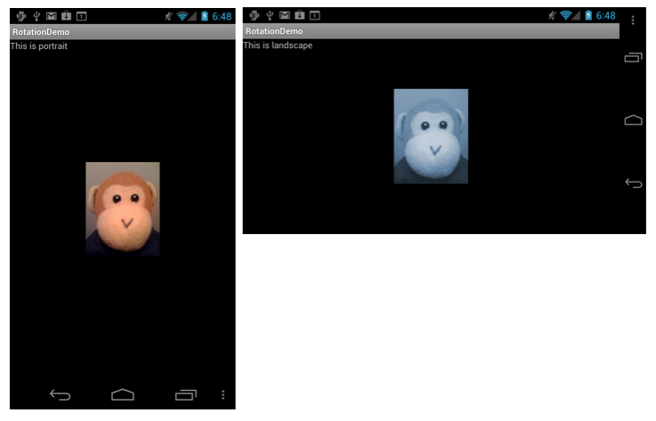

# Rotation Demo

This is the sample code for the article [Handling Rotation](https://docs.microsoft.com/xamarin/android/app-fundamentals/handling-rotation).

It shows various techniques for working with device orientation changes in Mono for Android.

