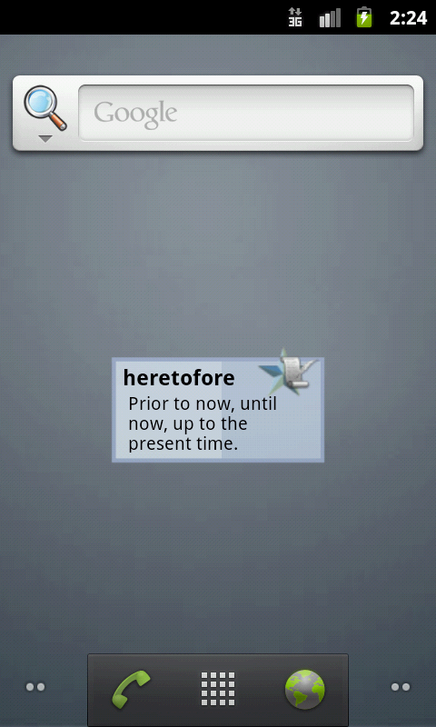

# Simple Widget

This sample shows a simple widget which fetches the word of
the day from Wiktionary.

## To Run

* Deploy to target device using Build -> Deploy
* Long tap on the desktop
* Choose Widgets -> Wiktionary Sample

The widget will be added to your desktop.

