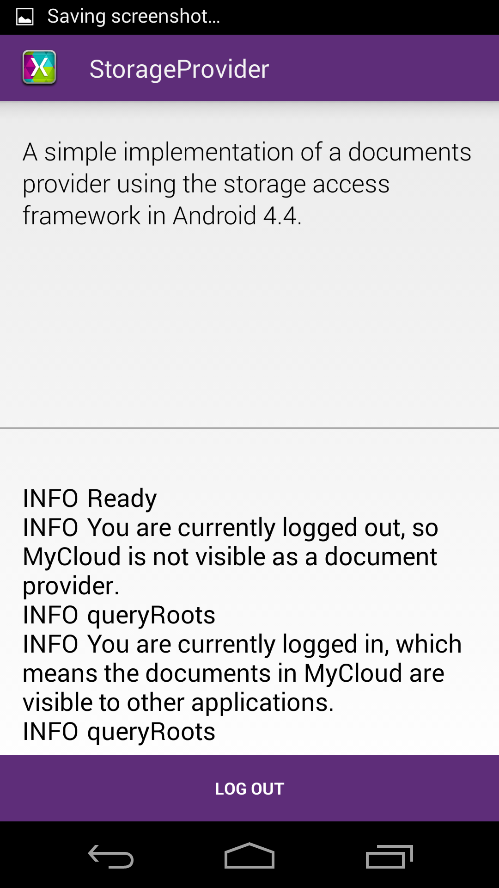

# Storage Provider

This sample demonstrates how to use the DocumentsProvider API to manage
documents and expose them to the Android system for sharing.

The `Storage Client` sample can be used to access this provider. Toggling
the `LOG IN` button will hide or show `MyCloud` in the document providers
list within `Storage Provider`.

