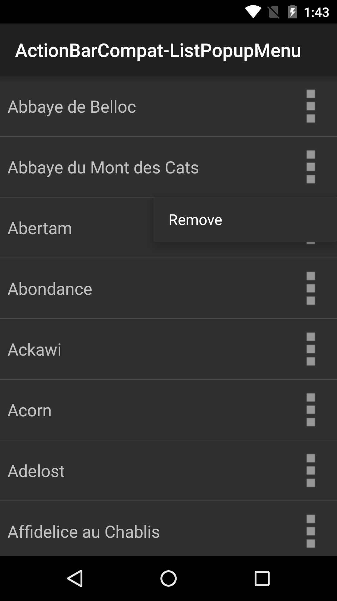

# ActionBarCompat ListPopupMenu Sample

This sample shows how to display a pop up menu using PopupMenu from the v7 appcompat library.

## Introduction

This sample displays a list of items and for each item, an icon can be clicked. When it is clicked, a pop up menu is shown, placed below the item, using the PopupMenu from the v7 appcompat support library.

The sample uses ListFragment from the v4 support library to display the list. It shows how to instantiate and display the PopupMenu, as well as how to use `SetOnMenuItemClickListener()` to process the user actions on the PopupMenu.

## Instructions

* Tap on any delicious cheese in the list
* Observe a pop up menu being shown
* Tap 'Remove' on pop up menu
* Observe the delicious cheese being removed from the list

## Build Requirements
Using this sample requires the Android SDK platform for Android 5.1 (API level 21).

## Screenshots

 

## Authors
Copyright (c) 2014 The Android Open Source Project, Inc.

Ported from [Android ActionBarCompat-ListPopupMenu Sample](https://github.com/googlesamples/android-ActionBarCompat-ListPopupMenu)

Ported to Xamarin.Android by Dylan Kelly
