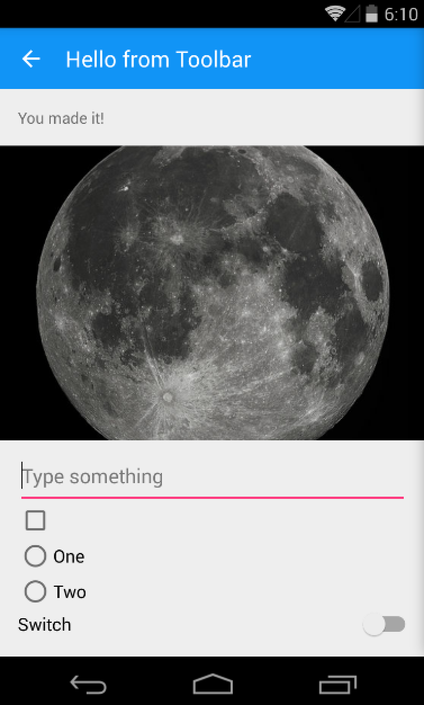

# Support v7 Toolbar

Basic sample of replacing the ActionBar with the new Support v7 app compat Toolbar.

## Instructions

* Run the project
* Click on the Toolbar items to see click handlers
* Click photo to navigate to details page

## Build Requirements

* Xamarin Studio 5.5+
* Xamarin Android 4.20+
* Android SDK with Android 5.0

## License

Copyright 2014 Xamarin
