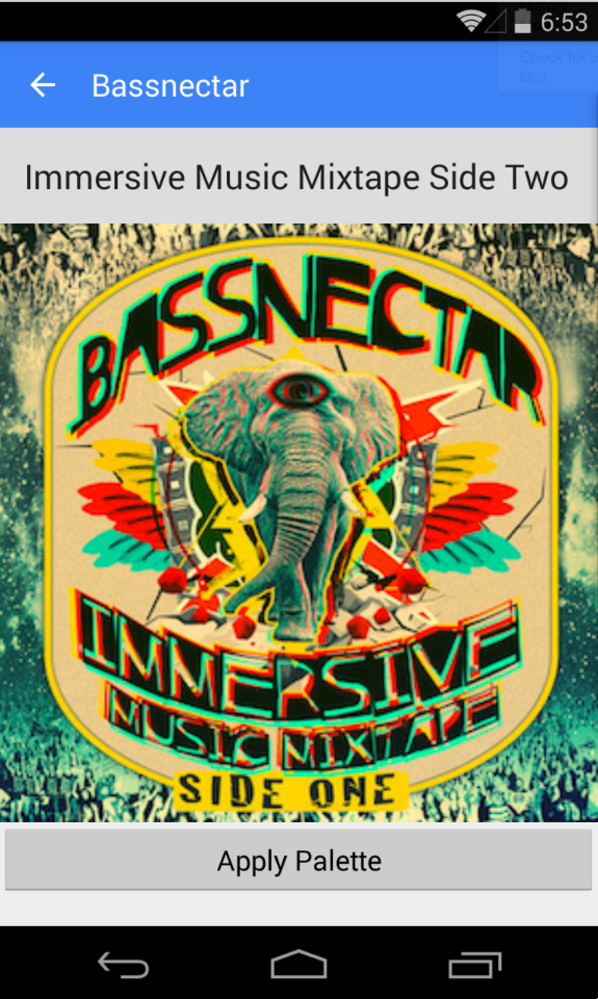

# Support v7 Palette

Basic sample of custom theme-ing your application with the Palette support library.

## Instructions

* Run the project
* Click on an item in the GridView to go to details page
* Click Apply Palette to see palette generation

## Build Requirements

* Xamarin Studio 5.5+
* Xamarin Android 4.20+
* Android SDK with Android 5.0

## License

Copyright 2014 Xamarin
