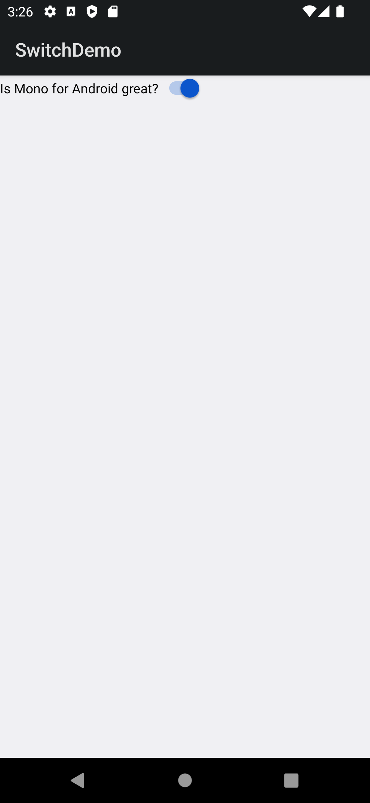

# Switch Demo

This sample app accompanies the article,
[Introduction to Switches](https://docs.microsoft.com/xamarin/android/user-interface/controls/switch), showing how to use the Switch control in Xamarin.Android.

