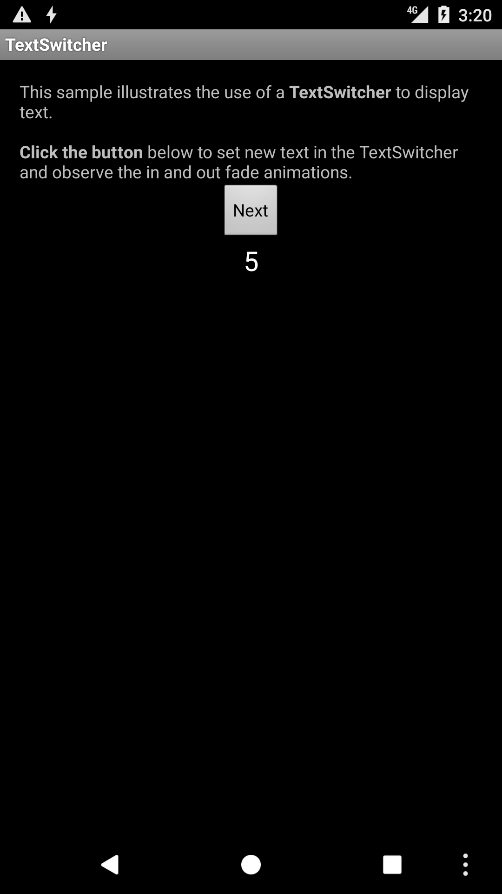

# TextSwitcher Sample

This sample illustrates the use of a TextSwitcher to display animations for text changes.

## Build Requirements
Using this sample requires the Android 8.0 (API 26) and the Xamarin.Android 7.5.x or higher.

## Authors
Copyright (c) 2016 The Android Open Source Project, Inc.  
Ported from [Android TextSwitcher Sample](https://github.com/googlesamples/android-TextSwitcher).  
Ported to Xamarin.Android by Gonzalo Martin.