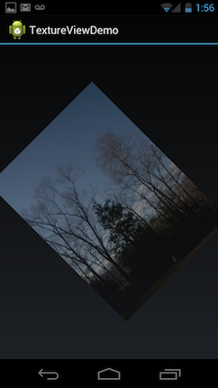

# TextureView Demo

This example shows how to use a TextureView with Ice Cream Sandwich.

A device is required for this example as the TextureView uses hardware acceleration.

This example is ported from the sample code at http://developer.android.com/reference/android/view/TextureView.html

