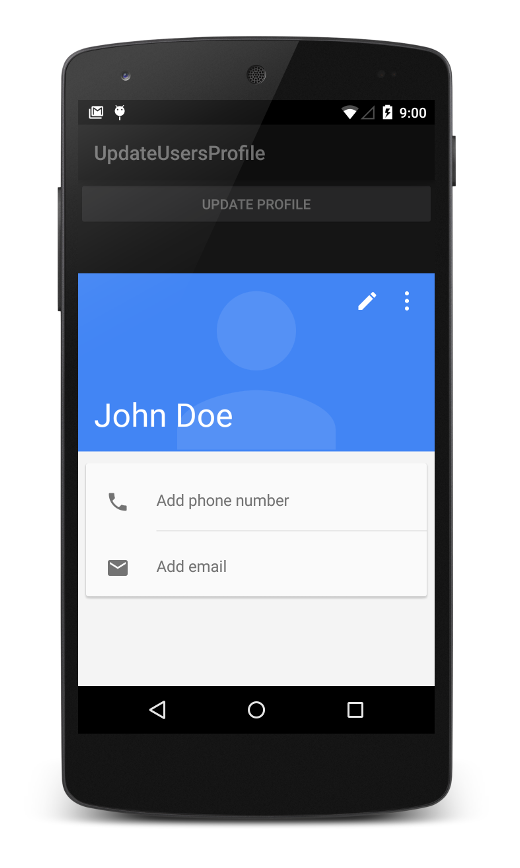

# Update the User's Profile

This sample app accompanies the recipe, 
[Update the User's Profile](http://developer.xamarin.com/recipes/android/data/contentproviders/update_the_users_profile/).

This sample creates a display name for the owner of the device ("John 
Doe") and adds this name to the user profile. The user profile data is 
read back to confirm that the name was set, then launches the 
**Contacts** app to view the user's profile. A single screen provides a 
button that initiates the update and view sequence: 

## Author 

Mark McLemore
