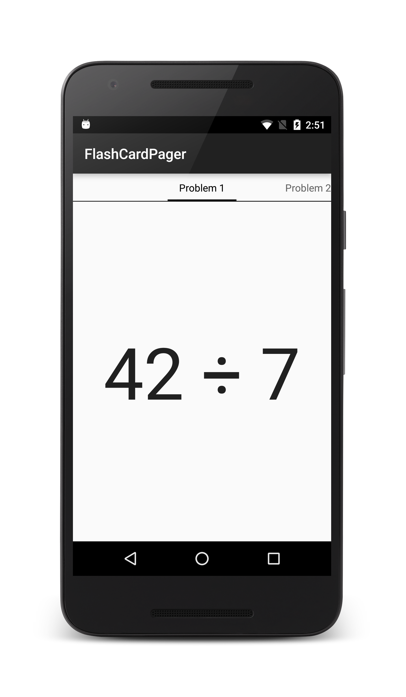

# FlashCardPager

**FlashCardPager** is a sample app that accompanies the article,
[ViewPager](https://docs.microsoft.com/xamarin/android/user-interface/controls/view-pager/).

This sample demonstrates how to use `ViewPager` and `PagerTabStrip` 
together to implement an app that presents a series of math problems on 
flash cards. The user can swipe left and right through the flash cards 
and tap on a math problem to reveal the answer. 

This app creates a `Fragment` for each flash card and implements an 
adapter derived from `FragmentPagerAdapter`. The heavy lifting of this 
app takes place in **FlashCardDeckAdapter.cs**, which adapts a flash 
card deck (implemented in **FlashCardDeck.cs**) to a `ViewPager` that 
is located and initialized in **MainActivity.cs**. The `ViewPager` 
layout includes a `PagerTabStrip` in **Main.axml**. Note that this app 
depends on Android Support Library v4.

## License

Copyright 2016 Xamarin
