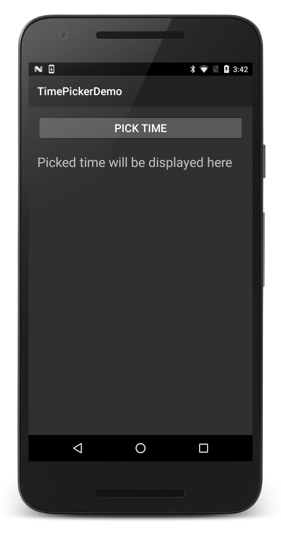

# TimePickerDemo

**TimePickerDemo** is a sample app that accompanies the article,
[Time Picker](https://docs.microsoft.com/xamarin/android/user-interface/controls/pickers/time-picker).

This sample demonstrates how to use the `TimePickerDialog`, wrapped in
a `DialogFragment`. This application displays the `TimePickerDialog` as
a modal dialog when the user clicks a button on an Activity. When the
time is set by the user, the dialog exits and a handler updates a
`TextView` on the Activity screen with the time that was selected.

## License

Copyright 2017 Xamarin
