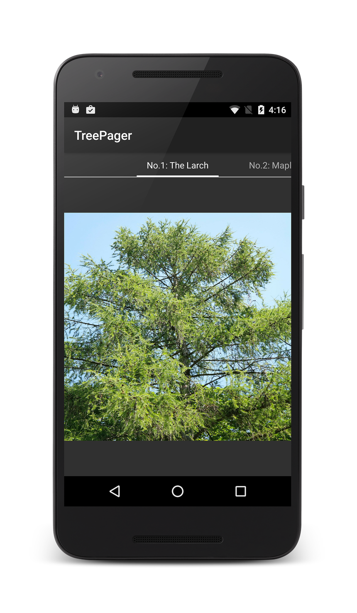

# TreePager

**TreePager** is a sample app that accompanies the article,
[ViewPager](https://docs.microsoft.com/xamarin/android/user-interface/controls/view-pager/).

This sample demonstrates how to use `ViewPager` and `PagerTabStrip` 
together to implement a simple image gallery of deciduous and evergreen 
trees. The user swipes left and right through a tree catalog. On each 
page of the catalog, the name of the tree is listed in the 
`PagerTabStrip` and an image of the tree is displayed in an 
`ImageView`. Because of the relative simplicity of this app, the added 
complexity of using Fragments is unnecessary. 

The heavy lifting of this app takes place in **TreePagerAdapter.cs**, 
which adapts a tree catalog (implemented in **TreeCatalog.cs**) to a 
`ViewPager` that is located and initialized in **MainActivity.cs**. The 
`ViewPager` layout includes a `PagerTabStrip` in **Main.axml**. Note 
that this app depends on Android Support Library v4.

## License

Copyright 2016 Xamarin
