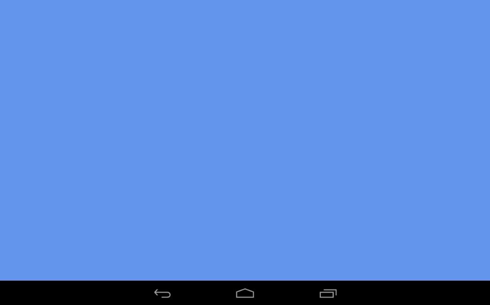

# MonoGame Empty Project for Android

This project serves as a starting-point for MonoGame Android projects.  It is the result of working through the Part 2 - Creating a MonoGame Android Project walkthrough.  It is titled WalkingGame as that is the name of the project created by the full Introduction to MonoGame walkthrough.

This single solution contains two projects:  one for Android and one cross-platform portable class library.

When executed this project displays only a blue screen.

## Author

Victor Chelaru