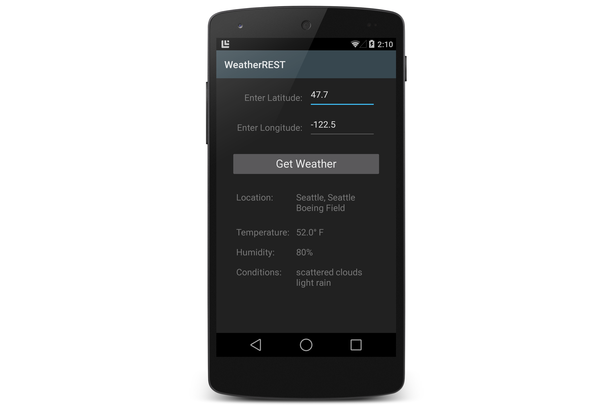

WeatherREST
===========

This sample app accompanies the article, 
[Call a REST Web Service](http://developer.xamarin.com/recipes/android/web_services/consuming_services/call_a_rest_web_service/).
You can use this sample to learn how to call a RESTful service via 
HTTP and parse the JSON results. 

This example app sends latitude and longitude information in an HTTP 
request (to *Geonames.org*) and gets back weather information for that 
longitude and latitude. The user keys in the global latitude and 
longitude parameters and then presses **Get Weather**. When the HTTP 
response is received, the app parses the results and displays a subset 
of the weather information in textbox fields in the lower half of the 
display: 

This example uses `System.Json` to parse the results of the HTTP 
request. To keep this example simple and focused on REST, this code 
does not use asynchronous calls to the server. 

You will need an Android device or emulator with a large screen (such as 
a Nexus 5 or an AVD with the WXGA720 skin) to view the results. 

Author
------ 

Mark McLemore
