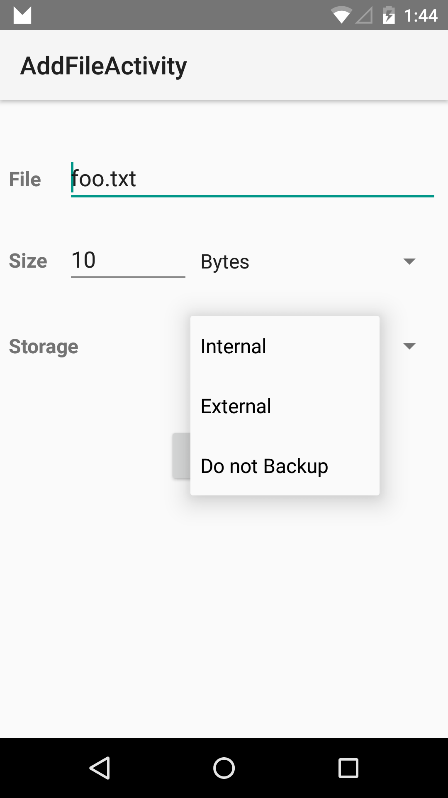

# AutoBackup Sample

This sample demonstrates how to selectively disable Automatic Backups in Android M.

## Instructions

- Tap the Add File button to create a file with selected specifications.

## Build Requirements

Using this sample requires the Android M Developer Preview and the Xamarin.Android M Web Preview

## License

Copyright (c) 2014 The Android Open Source Project, Inc.
Ported from [Android Automatic Backup Sample](https://github.com/googlesamples/android-AutoBackupForApps)
