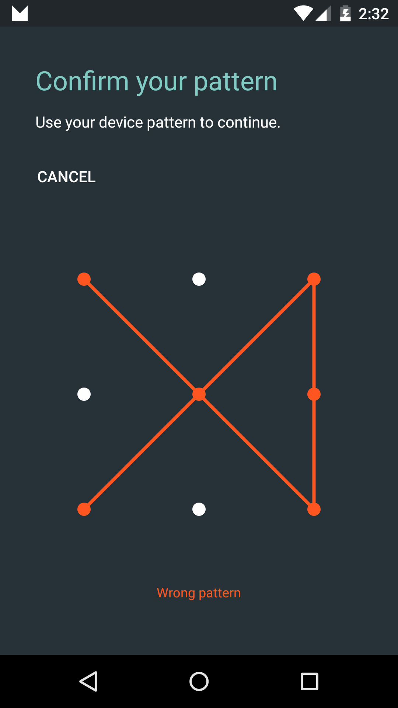

# Confirm Credential Sample

This sample demonstrates how to use device credentials (PIN, Pattern, Password) in your app.

## Instructions

- Set up a secure lock screen in **Settings > Security > Screenlock**.
- Tap the Purchase button and confirm the secure lock screen credentials.

## Build Requirements

Using this sample requires the Android M Developer Preview and the Xamarin.Android M Web Preview

## License

Copyright (c) 2014 The Android Open Source Project, Inc.
Ported from [Android Confirm Credential Sample](https://github.com/googlesamples/android-ConfirmCredential)
