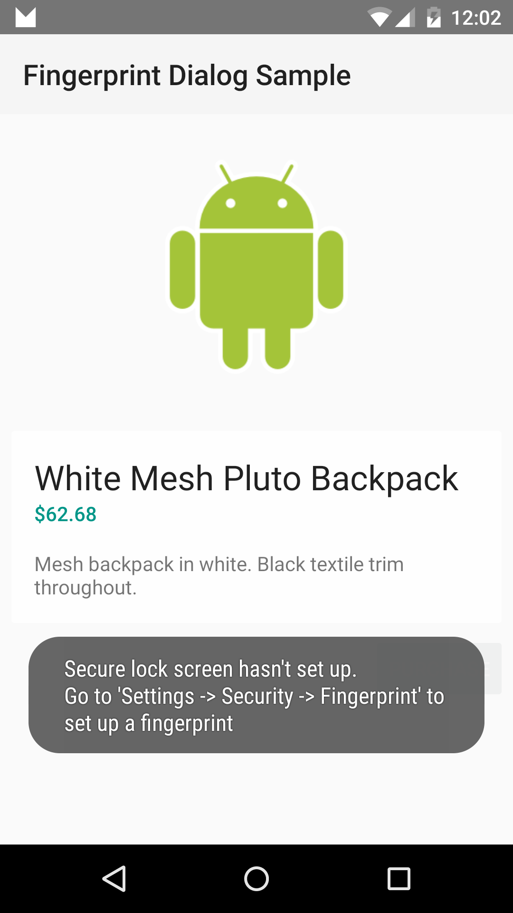

# Fingerprint Dialog Sample

This sample demonstrates how to use registered fingerprints to authenticate the user in an app.

## Instructions
* Touch the Purchase button to open a fingerprint authentication dialog.
* Either scan in your registered fingerprint to authenticate or enter your password.
* Requires a device with a built in fingerprint reader.
* This app does not store either your fingerprint nor your password.

## Build Requirements
Building this sample requires a device that is Android M or later, the Xamarin.Android M Web Preview, and the Android M Developer Preview.

## Authors
Copyright (c) 2014 The Android Open Source Project, Inc.
Ported from [Android Fingerprint Dialog Sample](https://github.com/googlesamples/android-FingerprintDialog)
Ported to Xamarin.Android by Aaron Sky