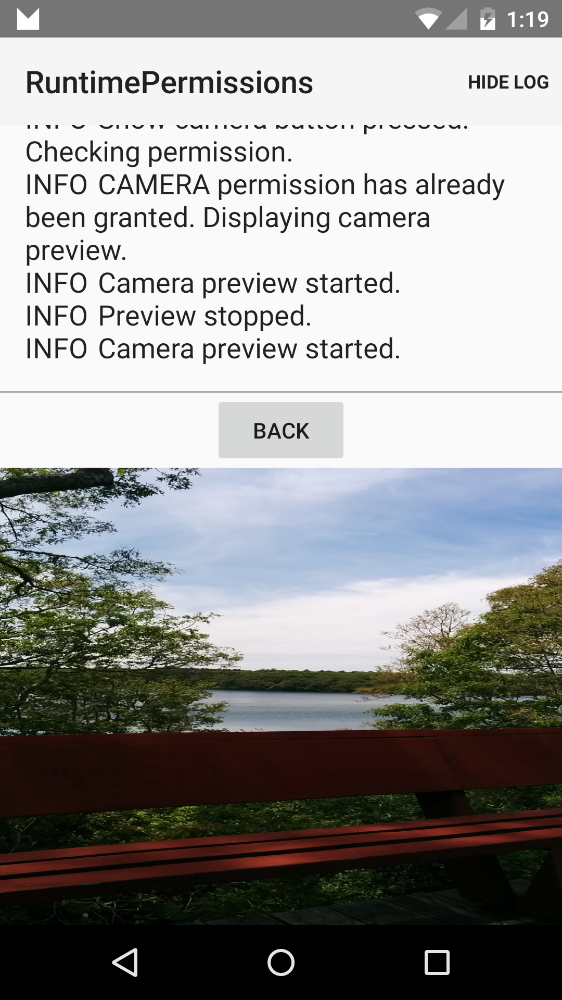

# Runtime Permissions Sample

This sample shows runtime permissions available in Android M and above. It shows how to check and request permissions at runtime,
handle backwards compatibility using the support library and how to declare optional permissions for M-devices only.

## Instructions

* Tap on the Camera or Contacts buttons to display a permissions request dialog.
* Grant permission to view Camera or Contacts fragments.

## Build Requirements
Using this sample requires the Android M Developer Preview and the Xamarin.Android M Web Preview

## Authors
Copyright (c) 2014 The Android Open Source Project, Inc.
Ported from [Android RuntimePermissions Sample](https://github.com/googlesamples/android-RuntimePermissions)
Ported to Xamarin.Android by Peter Collins