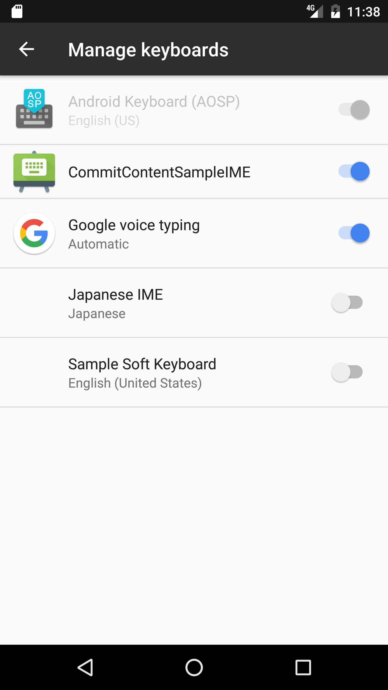

# CommitContentSample

This sample demonstrates how to write an keyboard which sends rich content (such as images) to text fields using the Commit Content API.

## Instructions

You **must** run first the *SampleIME* project (following the instructions to enable the virtual keyboard) and then you can run the *SampleApp* project.

**SampleIME**

This sample does not have a default Activity. After installing it, you will need to enable this app as a keyboard by navigating to Settings > Languages & Input > Virtual Keyboard > Manage Keyboards. This keyboard can then be accessed by pressing the virtual keyboard icon in the lower-right hand corner of the display while in a text field.

**SampleApp**

Users often want to communicate with emojis, stickers, and other kinds of rich content. In previous versions of Android, soft keyboards (input method editors or IMEs) could send only unicode emoji to apps. For rich content (such as images), apps had to either build app-specific APIs that couldn't be used in other apps or use workarounds like sending images through the Easy Share Action or the clipboard.

## Build Requirements
Using this sample requires the Android 7.1 (API 25) and the Xamarin.Android 7.1.99 or higher.

## Authors
Copyright (c) 2016 The Android Open Source Project, Inc.  
SampleIME ported from [CommitContentSampleIME](https://github.com/googlesamples/android-CommitContentSampleIME).  
SampleApp ported from [CommitContentSampleApp](https://github.com/googlesamples/android-CommitContentSampleApp).  
Ported to Xamarin.Android by Gonzalo Martin.
