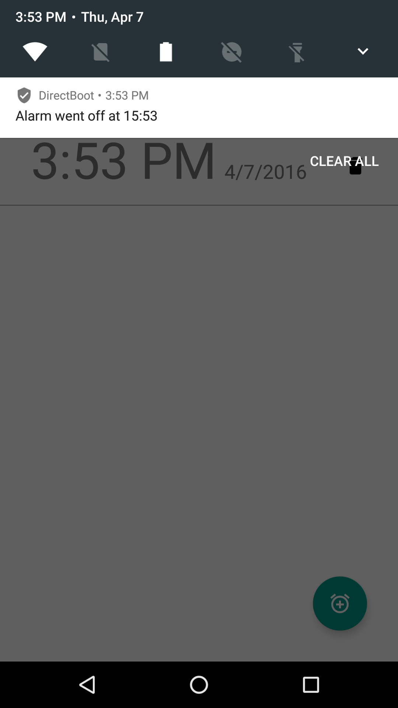

# Direct Boot Sample

This sample demonstrates how to store data in a device-protected storage which is always available
while the device is booted both before and after any user credentials(PIN/Pattern/Password) are entered.

Sensitive data (such as user's emails, auth tokens) shouldn't be stored in a device-protected storage
because the storage isn't protected by the user's credential (PIN/Pattern/Password).

## Instructions

* Tap the alarm button in the bottom right to add an alarm.
* When an alarm is triggered, a notification will be displayed. View the notification to end the alarm noise.

## Build Requirements

Using this sample requires the Android N Developer Preview and the Xamarin.Android N Web Preview.

## Author

Copyright (c) 2016 The Android Open Source Project, Inc.

Ported from [Android DirectBoot Sample](https://github.com/googlesamples/android-DirectBoot)

Ported to Xamarin.Android by Peter Collins
