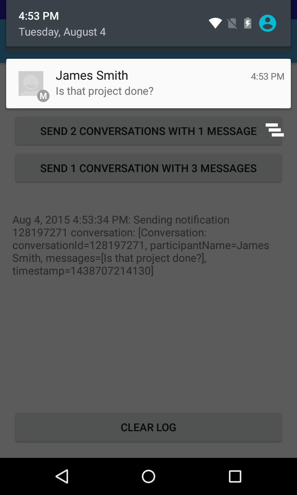

# Messaging Service Sample

This sample shows a simple service that sends notifications using
NotificationCompat. It also extends the notification with Remote
Input to allow Android N devices to reply via text directly from
the notification without having to open an App. The same Remote
Input object also allows Android Auto users to respond by voice
when the notification is presented there.
Note: Each unread conversation from a user is sent as a distinct
notification.

## Introduction

## Flow

MessagingFragment is shown to the user. Depending on the button clicked, the MessagingService is
sent a message. MessagingService in turn creates notifications which can be viewed either on the
device or in the messaging-simulator.

When a message is read, the associated PendingIntent is triggered and MessageReadReceiver is called
with the appropriate conversationId. Similarly, when a reply is received, the MessageReplyReceiver
is called with the appropriate ConversationId. MessageLogger logs each event and shows them in a
TextView in MessagingFragment for correlation.

## Instructions

* Launch the application
* Tap any button to send conversations
* Read the message and observe the application registering the event
* Clear the log and tap any button to send additional conversations

## Build Requirements

Using this sample requires the Android SDK platform for Android 5.0 (API level 23).

## Screenshots

   

## Authors

Copyright (c) 2016 The Android Open Source Project, Inc.

Ported from [Android MessagingService Sample](https://github.com/googlesamples/android-messagingService)

Ported to Xamarin.Android by Dylan Kelly
