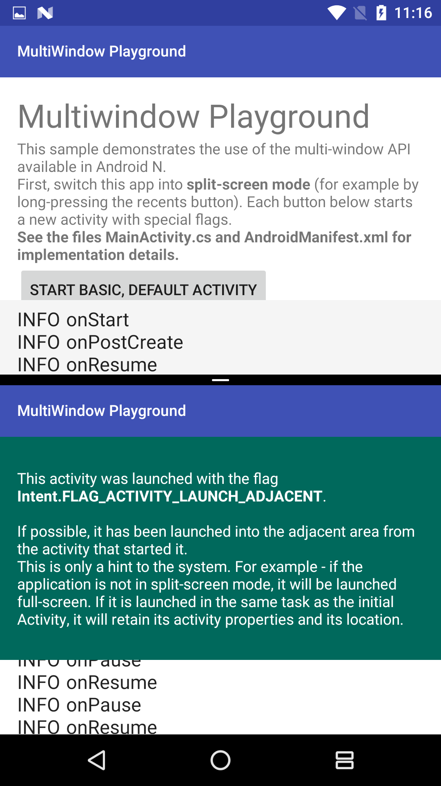

# MultiWindow Playground Sample

This sample demonstrates how to use the MultiWindow API introduced in Android N allowing adjacent and floating app windows.

## Instructions

* Launch activities with different MultiWindow configurations by clicking the buttons.
* Observe lifecycle events logged on screen.

## Build Requirements

Using this sample requires the Android N Developer Preview and the Xamarin.Android N Web Preview.

## Author

Copyright (c) 2016 The Android Open Source Project, Inc.  
Ported from [Android MultiWindowPlayground Sample](https://github.com/googlesamples/android-MultiWindowPlayground).  
Ported to Xamarin.Android by Kyle White.