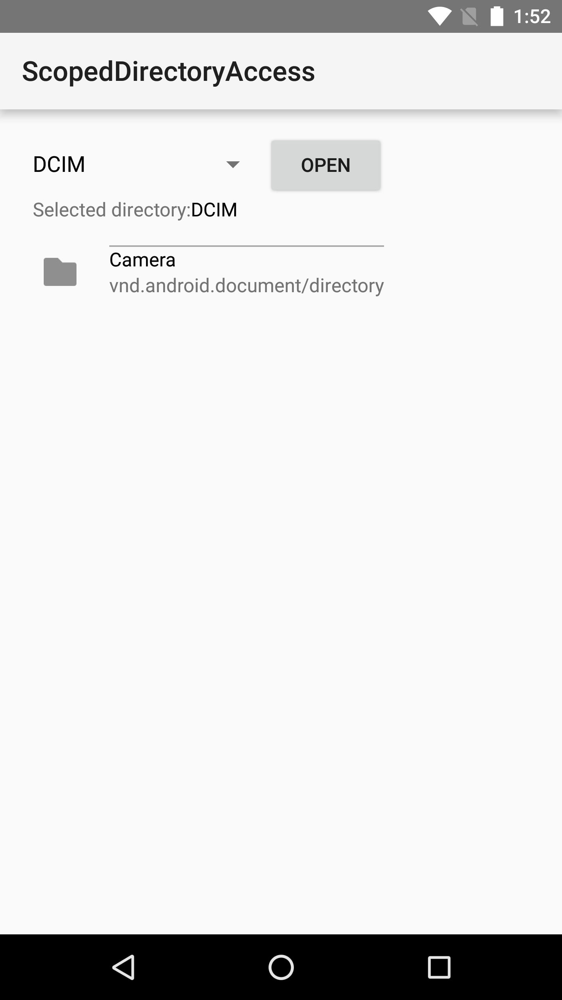

# Scoped Directory Access Sample

This sample demonstrates how to use the Scoped Directory Access API introduced Android N to easily access specific directories.
This serves as an alternative to having to define READ_EXTERNAL_STORAGE or WRITE_EXTERNAL_STORAGE permissions in your manifest.

## Instructions

* Select a directory location you'd like to access from the dropdown menu.
* Tap 'Open' to request permission and then display the contents of the directory.

## Build Requirements
Using this sample requires the Android N Developer Preview and the Xamarin.Android N Web Preview, as well as at least Android Build Tools v24.0.0 rc1.

## Authors
Copyright (c) 2014 The Android Open Source Project, Inc.
Ported from [Android ScopedDirectoryAccess Sample](https://github.com/googlesamples/android-ScopedDirectoryAccess)
Ported to Xamarin.Android by Peter Collins