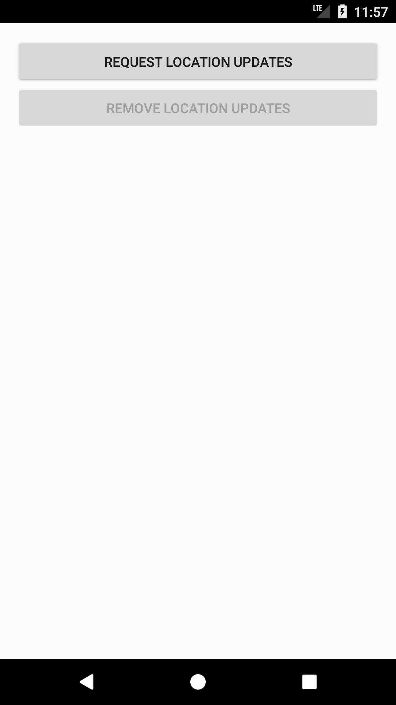

# LocationUpdatesForegroundService Sample

This sample demonstrates how to use the Location API to get updates about a device's location using a bound and started foreground service.

## Instructions

Press the “Request Location Updates” button to start the location updates service and listen any location changes.
Press the “Remove Location Updates” if you do not want to listen any location updates.

## Build Requirements

Using this sample requires the Android 8.0 (API 26) and Xamarin.Android 7.5.x or higher.

## License

Copyright (c) 2017 The Android Open Source Project, Inc.  
Ported from [Android LocationUpdatesForegroundService Sample](https://github.com/googlesamples/android-play-location/tree/master/LocationUpdatesForegroundService).  
